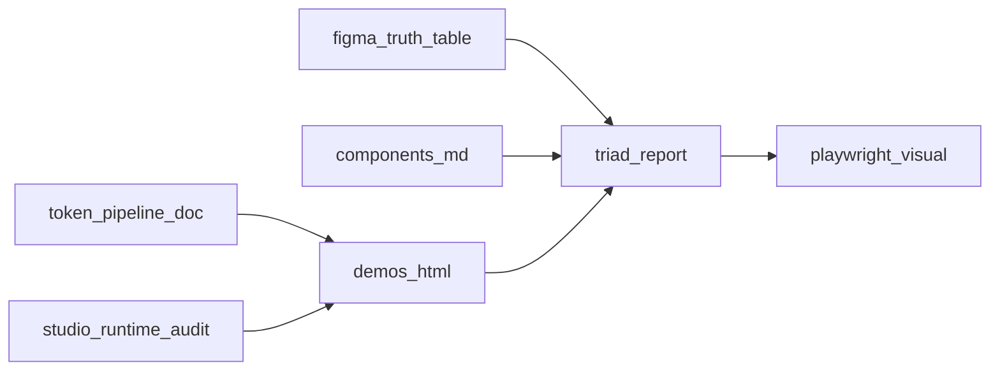

# PRD：Figma 1:1 对齐能力（设计规范 × 代码 × 证据链）

| 属性 | 内容 |
|------|------|
| 文档状态 | Draft → Review → Approved |
| 真源 Figma 文件 | `fileKey` = **`KJfy0GFDs8kLsXTzhTxAjd`**（D.S-Web-Com_Light_V2_2026，官方库） |
| 协作讨论稿（非视觉验收真源） | `VqEug9MsAHfG1lpRNP5FKy`（仅 Playground / 讨论，见 [PATH-A-WORKFLOW.md](./PATH-A-WORKFLOW.md)） |
| 治理约束 | [.design-spec/docs/ALIGNMENT_GOVERNANCE.md](../../.design-spec/docs/ALIGNMENT_GOVERNANCE.md) |
| 机器可读真源表 | [.design-spec/config/figma_truth_table.json](../../.design-spec/config/figma_truth_table.json) |

本文档将「Figma 1:1 偏差根因与项目能力建设计划」改写为 **可签字 PRD**：明确需求、目标、**验收标准**与**如何验证**。原 Cursor plan 文件不作为工程真源；以本 PRD 与仓库内链接文件为准。

---

## 1. 背景与问题陈述

### 1.1 业务背景

企业级 Web UI（`@UIDX-11/dspark-web-ui`）需与 Figma 设计库在 **Light** 下可对账对齐；同时须遵守设计规范中 **Arco Design Web React（API / 行为）** 与 **Figma（视觉数值）** 的双真源治理（见 ALIGNMENT_GOVERNANCE §1）。

### 1.2 根因摘要（为何「看起来总不 1:1」）

| ID | 根因 | 影响 |
|----|------|------|
| R1 | 对稿混用 **讨论稿** 与 **官方 published 库** | 变量绑定/变体不一致，产生假偏差 |
| R2 | **React（theme + Tailwind + CVA）** 与 **静态 HTML demos（tokens.css + studio_runtime）** 样式管道不同 | 同一 token 语义在两路实现上漂移 |
| R3 | 治理允许 **Arco + 推断态**；MD 中显式「待与 Figma 对齐」 | 矩阵未闭项前无法宣称全局视觉 1:1 |
| R4 | `studio_runtime.css` 等仍存在 **裸 px / 色值字面量** 与治理 §1.3 张力 | 壳层/栅格与画板网格系统性偏差 |
| R5 | HTML **由 MD + 生成器编译**，非 Figma 节点导出 | Figma/MD/token 未同步则 HTML 不会自动 1:1 |
| R6 | 浏览器与 Figma 渲染差异（字体、亚像素、图标笔画等） | 像素 diff 可能非零，须有 **文档化阈值** |
| R7 | 静态 HTML **未绑定 Figma 导出图标 manifest** | 图标区与稿不一致，叠加 R6 |

### 1.3 约束输入（必读）

以下路径以仓库完整结构为准（若某文件尚未合入，由 `docs-cross-linking` 任务补齐）：

- `docs/visual-qa/README.md`（视觉 QA 入口）
- `docs/visual-qa/PATH-A-WORKFLOW.md`
- `docs/visual-qa/TOKEN-SPOTCHECK.md`
- `docs/visual-qa/PLAYWRIGHT.md`
- [.design-spec/docs/ALIGNMENT_GOVERNANCE.md](../../.design-spec/docs/ALIGNMENT_GOVERNANCE.md)

---

## 2. 产品目标

### 2.1 主目标（P0）

在 ALIGNMENT_GOVERNANCE 约定边界内，建立 **MD ↔ 静态 HTML demo ↔ Figma 官方 node** 的 **逐组件可追溯、可对账、可证据验收** 能力。  
**说明**：「1:1」包含 **允许的渲染差异**（见 TOKEN-SPOTCHECK / PATH-A），**不等于**像素 diff 恒为 0。

**验收标准（主目标 DoD）**

- 每个纳入范围的组件 ID 具备：canonical Figma 链接（真源表）、对应 MD、约定路径 HTML demo，且三边对账表中 **无未解释的「缺失」**。
- 对外宣称「某组件已对稿完成」前，该组件在三边表中 **无不一致未处置状态**。

**如何验证**

- 运行 `python3 .design-spec/scripts/triad_reconcile.py`，检查产出 [.design-spec/docs/reports/MD_HTML_Figma_TRIAD.md](../../.design-spec/docs/reports/MD_HTML_Figma_TRIAD.md)。
- 人工抽查：在 Figma 打开 canonical node，对照 MD 变体矩阵与 HTML `#liveRoot` 展示集合。

### 2.2 次目标（P1）

收敛 **Token / CSS 变量单一出口或显式映射**，降低 React Playground 与 design-spec 静态 HTML 的 **系统性**漂移。

**验收标准**

- 文档化「单一出口」策略（见 FR-10）；React 与 demos 至少一路径 **声明为权威** 并有迁移计划。

**如何验证**

- 评审 [.design-spec/docs/TOKEN_PIPELINE_STRATEGY.md](../../.design-spec/docs/TOKEN_PIPELINE_STRATEGY.md)（若缺失则由 `unify-token-pipeline` 任务补齐）。
- 对照 `src/styles/theme.css` 与 `.design-spec/tokens/dist/tokens.css` 变量表做 spot-check（TOKEN-SPOTCHECK 清单）。

### 2.3 远期目标（P2 / 里程碑 P5–P7）

- Vue3 + Vite + Tailwind 工程、React→Vue 适配与发布验收（依赖 token 单一出口与三边闭项策略）。

**验收标准**

- 单独里程碑 PRD 或本节附录列出 **入口包、校验脚本、验收报告** 模板；不在本 PRD 主范围阻塞 A–D。

**如何验证**

- 检查 `docs/cross-framework/` 与 release checklist（由 `future-p6-p7-vue-build` 任务产出）。

---

## 3. 范围与非目标

### 3.1 In Scope

- 官方库真源表维护与索引（COMPONENT-FIGMA-LINKS、figma_truth_table.json）。
- MD–HTML–Figma 三边对账报告与 CI/脚本辅助。
- `studio_runtime.css` 与生成器字面量治理、图标 manifest 注入链路。
- MATRIX 路径 B、design-spec e2e 截图证据链扩展。
- Figma **命名审查**（只读清单 + 书面建议；禁止未确认批量 Rename）。
- React+Vite+Tailwind demos 子应用（与静态生成器解耦或并存）。
- 对齐审计报告、文档互链。

### 3.2 Out of Scope

- 将讨论稿 `VqEug…` 作为 **视觉验收**唯一真源。
- 未获产品/设计确认前，在 Figma 内 **批量 Rename** 或破坏性改组件集。
- 在三边表仍存在 **未闭「缺失/不一致」** 时，对外宣称 **全局对稿完成**。

---

## 4. 角色与职责

| 角色 | 职责 | 验证签字 |
|------|------|----------|
| 设计 | 维护官方库 node、确认 MATRIX / 命名审查结论 | [MATRIX.md](./MATRIX.md) 设计列 |
| 前端 | MD、生成器、token、demos、e2e 基线 | MATRIX 前端列 + PR |
| QA / 发布 | CI 截图 gate、基线 OS 一致性 | CI 配置与基线 PR |
| 文档 | 互链、审计报告、COMPONENT-FIGMA-LINKS | docs-cross-linking |

---

## 5. 功能需求（FR）

每条含：**优先级**、**描述**、**主要工件**、**验收标准（DoD）**、**如何验证（Who / How / Where / Artifact）**。

### 阶段 A — 真源与索引

| ID | 优先级 | 描述 | 主要工件 | 验收标准（DoD） | 如何验证 |
|----|--------|------|----------|-----------------|----------|
| FR-01 | P0 | 视觉对稿真源固定为官方库 `KJfy…`；讨论稿仅协作 | `docs/visual-qa/README.md`、`PATH-A-WORKFLOW.md` | 视觉 QA 文档写明真源 fileKey；PATH-A 不将讨论稿当 SoT | 人工审上述两文档 |
| FR-02 | P0 | 维护机器可读真源表：每组件 ID 对应 Figma node-id 列表 | `.design-spec/config/figma_truth_table.json` | JSON `rows` 覆盖与 `.design-spec/docs/components/*.md`（排除 README/_template/intent-index）一致的组件 ID 集合 | `python3 -c "import json;…"` 校验 key 集合 vs glob |
| FR-03 | P0 | 人读索引：包导出 ↔ MD ↔ Figma 深链接 | `docs/visual-qa/COMPONENT-FIGMA-LINKS.md` | 表中每个已导出组件有 MD 链接；Figma 列与真源表 primary 不矛盾 | 人工 + triad 报告「MD 多出 node」列为空或可解释 |
| FR-04 | P0 | 各组件 MD References 含官方库 `node-id=` 深链接，且与真源表可对齐 | `.design-spec/docs/components/<id>.md` | 对账表中「MD 未覆盖 canonical node」对 P0 组件为 0 | `triad_reconcile.py` + 设计抽查 |
| FR-05 | P1 | MATRIX 路径 B 与 HTML demos 对齐策略 | `docs/visual-qa/MATRIX.md` | 路径 B 列从 N/A 变为可填组件时有对应 demo 路径/结论 | 人工维护 MATRIX |

**计划 todo 映射**：`align-figma-source`、`figma-truth-table` → FR-01～FR-05。

---

### 阶段 B — Token 管道

| ID | 优先级 | 描述 | 主要工件 | 验收标准（DoD） | 如何验证 |
|----|--------|------|----------|-----------------|----------|
| FR-10 | P1 | 审计 React 长名变量 vs `tokens/dist`；单一出口或映射层文档 | `.design-spec/docs/TOKEN_PIPELINE_STRATEGY.md` | 文档含：权威源、映射策略、迁移阶段、责任方 | 架构评审会议记录 |
| FR-11 | P2 | （可选）Figma Variables → tokens/src 对账周期 | `.design-spec/tokens/src/` | 变更流程写清：谁触发、如何 diff | 文档审阅 |

**计划 todo 映射**：`unify-token-pipeline` → FR-10、FR-11。

---

### 阶段 C — 生成器与运行时样式

| ID | 优先级 | 描述 | 主要工件 | 验收标准（DoD） | 如何验证 |
|----|--------|------|----------|-----------------|----------|
| FR-20 | P0 | `studio_runtime.css` 字面量审计与 token 化 backlog | `.design-spec/generator/studio_runtime.css` | 审计脚本可复现输出；关键 px/hex 有 issue 或已替换为 `var(--*)` | `python3 .design-spec/scripts/studio_runtime_literal_audit.py` |
| FR-21 | P1 | 生成器生成后门禁：禁止未授权裸字面量（与治理对齐） | `.design-spec/generator/generate_component_html_demos.py` | 策略写清：警告 vs CI fail；白名单与 §1.3 一致 | CI 或本地脚本日志存档 |
| FR-22 | P0 | HTML 路径契约：`<slug>.html` 仅由 `<slug>.md` 生成 | `.design-spec/demos/components/` | 无孤儿 HTML；无错配 slug | triad 报告 + `glob` 对比 |
| FR-23 | P0 | 图标：对稿 HTML 仅经 manifest 引用 Figma 导出 SVG | `.design-spec/assets/icons/icons.manifest.json` + 生成器注入 | manifest 条目有 `relativePath` 且生成页可解析（或文档声明占位策略） | 抽查生成 HTML `<template id="ds-icon-*">`；禁止未登记 CDN 图标作为默认 |

**计划 todo 映射**：`audit-studio-runtime` → FR-20、FR-21；`figma-icons-html-demos` → FR-23。

---

### 阶段 D — 证据链与自动化

| ID | 优先级 | 描述 | 主要工件 | 验收标准（DoD） | 如何验证 |
|----|--------|------|----------|-----------------|----------|
| FR-30 | P1 | 扩展 design-spec e2e：与三边表一致的 demo 截图 | `.design-spec/e2e/tests/` | 新增 spec 覆盖约定 slug 列表；`maxDiffPixels`/`threshold` 与文档一致 | `cd .design-spec/e2e && npm run test:visual`（需基线） |
| FR-31 | P0 | 基线 PNG 在 `ubuntu-latest` 生成（治理 §4） | `.design-spec/e2e/tests/**/*-snapshots/**` | CI 与工作流说明一致 | GHA run artifact + ALIGNMENT_GOVERNANCE §4 |
| FR-32 | P1 | Playground（根目录 Vite）视觉 QA 与 TOKEN spot-check | `e2e/visual-qa-app.spec.ts`、`docs/visual-qa/PLAYWRIGHT.md` | 与 TOKEN-SPOTCHECK 步骤可复现 | 按 PLAYWRIGHT.md 执行 |

**计划 todo 映射**：`visual-regression` → FR-30～FR-32。

---

### 阶段 E — MD 闭项、审计、文档与 Vue 里程碑

| ID | 优先级 | 描述 | 主要工件 | 验收标准（DoD） | 如何验证 |
|----|--------|------|----------|-----------------|----------|
| FR-40 | P0 | 未闭「不一致」不得宣称对稿完成 | `close-md-gaps` 流程 | CLOSE_MD_GAPS 报告中 P0 项为 0 或可接受签字豁免 | `python3 .design-spec/scripts/close_md_gaps_scan.py` → `CLOSE_MD_GAPS.md` |
| FR-41 | P0 | 全量 MD 审计（僵尸字段、必备章节） | `.design-spec/scripts/components_md_audit.py` | `COMPONENTS_MD_AUDIT.md` 无未处理「missing H2」类问题 | `python3 .design-spec/scripts/components_md_audit.py` |
| FR-42 | P1 | Figma 命名审查表（只读；禁止未确认 Rename） | `.design-spec/docs/reports/FIGMA_NAMING_AUDIT_TEMPLATE.md` | 模板含：node、组件名、Property、建议名、状态 | 设计负责人签字 |
| FR-43 | P1 | 对齐审计报告（含三边结论摘要） | `docs/visual-qa/ALIGNMENT_AUDIT_REPORT.md` | 报告引用 triad 路径与 MATRIX 汇总 | PR 评审 |
| FR-44 | P1 | 文档站点/批量 MD  completeness（准入对齐 audit） | `docs-system-batch` | intent-index 与模板一致；缺口有 backlog | 文档 PR checklist |
| FR-45 | P1 | README、tokens、visual-qa、components 互链 | 根目录 `README.md`、`docs/` | 从 README 可达本 PRD 与 DOCUMENTATION_MAP（若存在） | 人工点击检查 |
| FR-46 | P2 | demos-react：React+Vite+Tailwind，真源表驱动矩阵/导航 | `.design-spec/demos-react/` | `pnpm/npm run dev` 可启动；消费 tokens.css 与 truth JSON | 本地 smoke |
| FR-47 | P2 | P5 Vue 预工程 + P6/P7 构建发布 | `docs/cross-framework/` 等 | 单独 checklist 与验收报告模板 | 里程碑评审 |

**计划 todo 映射**：`close-md-gaps` → FR-40；`audit-design-spec-components-md` → FR-41；`audit-figma-naming` → FR-42；`alignment-audit-report` → FR-43；`docs-system-batch` → FR-44；`docs-cross-linking` → FR-45；`demos-react-tailwind` → FR-46；`future-p5-vue-prep`、`future-p6-p7-vue-build` → FR-47。

---

## 6. 非功能需求（NFR）

| ID | 描述 | 验收标准 | 如何验证 |
|----|------|----------|----------|
| NFR-01 | 可维护性：真源表 JSON + 脚本可重复生成报告 | 新同事可按 README 跑通 triad + audit | 新人演练记录 |
| NFR-02 | 可追溯性：三边表列完整 | triad 表含：组件ID、MD、HTML、canonical nodes、meta、问题摘要 | triad Markdown diff review |
| NFR-03 | CI 稳定性：同 OS 截图、阈值文档化 | 与 PLAYWRIGHT + e2e README 一致 | CI 绿 + 基线 PR |
| NFR-04 | 流程安全：Figma 改名须确认 | 无未批注的批量 rename PR | 设计负责人确认 |

---

## 7. 全局验收标准（发布闸门摘要）

在对外发布「设计对齐阶段性成果」或「某批次组件已对稿」前，须同时满足：

1. **真源**：官方库 `KJfy…`；真源表与 COMPONENT-FIGMA-LINKS、MD References **无未裁决冲突**。
2. **三边**：`MD_HTML_Figma_TRIAD.md` 中 P0 组件 **无「缺 MD / 缺 HTML / 缺 meta」**。
3. **闭项**：`CLOSE_MD_GAPS.md` 中阻塞项已关闭或已签字豁免（FR-40）。
4. **图标**：对稿路径未使用未登记第三方图标为默认（FR-23）。
5. **自动化**：若启用视觉 gate，基线与 CI OS 满足 ALIGNMENT_GOVERNANCE §4（FR-31）。

**如何验证（一次跑完「证据包」）**

```bash
# 仓库根目录
python3 .design-spec/scripts/triad_reconcile.py
python3 .design-spec/scripts/components_md_audit.py
python3 .design-spec/scripts/close_md_gaps_scan.py
python3 .design-spec/scripts/studio_runtime_literal_audit.py
python3 .design-spec/generator/generate_component_html_demos.py
cd .design-spec/e2e && npm test   # 烟雾；视情况 npm run test:visual
```

产物路径：

- `.design-spec/docs/reports/MD_HTML_Figma_TRIAD.md`
- `.design-spec/docs/reports/COMPONENTS_MD_AUDIT.md`
- `.design-spec/docs/reports/CLOSE_MD_GAPS.md`

---

## 8. 验证方法总表（四要素）

| 方法 | Who | How | Where | Artifact |
|------|-----|-----|-------|------------|
| 人工走查 | 设计 + 前端 | Figma node vs MD 矩阵 vs HTML | Figma + 浏览器 file:// | MATRIX 签字 |
| 脚本对账 | 前端 | `triad_reconcile.py` 等 | 本地 / CI | `MD_HTML_Figma_TRIAD.md` |
| 自动化截图 | QA + 前端 | Playwright `toHaveScreenshot` | `.design-spec/e2e` | `*-snapshots/*.png` |
| Figma 只读元数据 | 设计 / agent | MCP `get_metadata` / `get_design_context` | Figma API | 命名审查表 Markdown |

---

## 9. 里程碑与依赖

| 阶段 | 内容 | 依赖 |
|------|------|------|
| A | 真源表 + MD 链接 + MATRIX | 无 |
| B | Token 单一出口文档 | A（References 稳定后更易对齐） |
| C | studio_runtime + 生成器 + 图标 | A、B（token 稳定减少反复） |
| D | e2e 截图 gate | C（视觉稳定） |
| E | 审计报告、互链、Vue 里程碑 | A–D |



---

## 附录 A：需求追溯矩阵（FR / NFR → 计划 todo）

| FR/NFR | 计划 todo id | 主要工件 |
|--------|--------------|----------|
| FR-01～FR-05 | align-figma-source, figma-truth-table | figma_truth_table.json, COMPONENT-FIGMA-LINKS.md, MATRIX.md |
| FR-10～FR-11 | unify-token-pipeline | TOKEN_PIPELINE_STRATEGY.md |
| FR-20～FR-22 | audit-studio-runtime | studio_runtime.css, generate_component_html_demos.py |
| FR-23 | figma-icons-html-demos | icons.manifest.json |
| FR-30～FR-32 | visual-regression | .design-spec/e2e, MATRIX.md |
| FR-40 | close-md-gaps | CLOSE_MD_GAPS.md, button.md 等 |
| FR-41 | audit-design-spec-components-md | COMPONENTS_MD_AUDIT.md |
| FR-42 | audit-figma-naming | FIGMA_NAMING_AUDIT_TEMPLATE.md |
| FR-43 | alignment-audit-report | ALIGNMENT_AUDIT_REPORT.md |
| FR-44 | docs-system-batch | docs-site / 组件 MD 模板 |
| FR-45 | docs-cross-linking | README.md, DOCUMENTATION_MAP |
| FR-46 | demos-react-tailwind | .design-spec/demos-react/ |
| FR-47 | future-p5-vue-prep, future-p6-p7-vue-build | docs/cross-framework/ |
| NFR-01～NFR-04 | 贯穿各 todo | CI + 评审记录 |

---

## 附录 B：文档互链（维护检查单）

- [x] 根 [README.md](../../README.md) → `docs/visual-qa/README.md` 与本 PRD、`docs/DOCUMENTATION_MAP.md`。
- [x] [docs/visual-qa/README.md](./README.md) → 回本 PRD 与 COMPONENT-FIGMA-LINKS。
- [x] `docs/DOCUMENTATION_MAP.md`：已创建并收录本 PRD。

---

## 修订记录

| 版本 | 日期 | 说明 |
|------|------|------|
| 0.1 | 2026-05-11 | 首版：由「Figma 1:1 PRD 改写」实施计划产出 |
